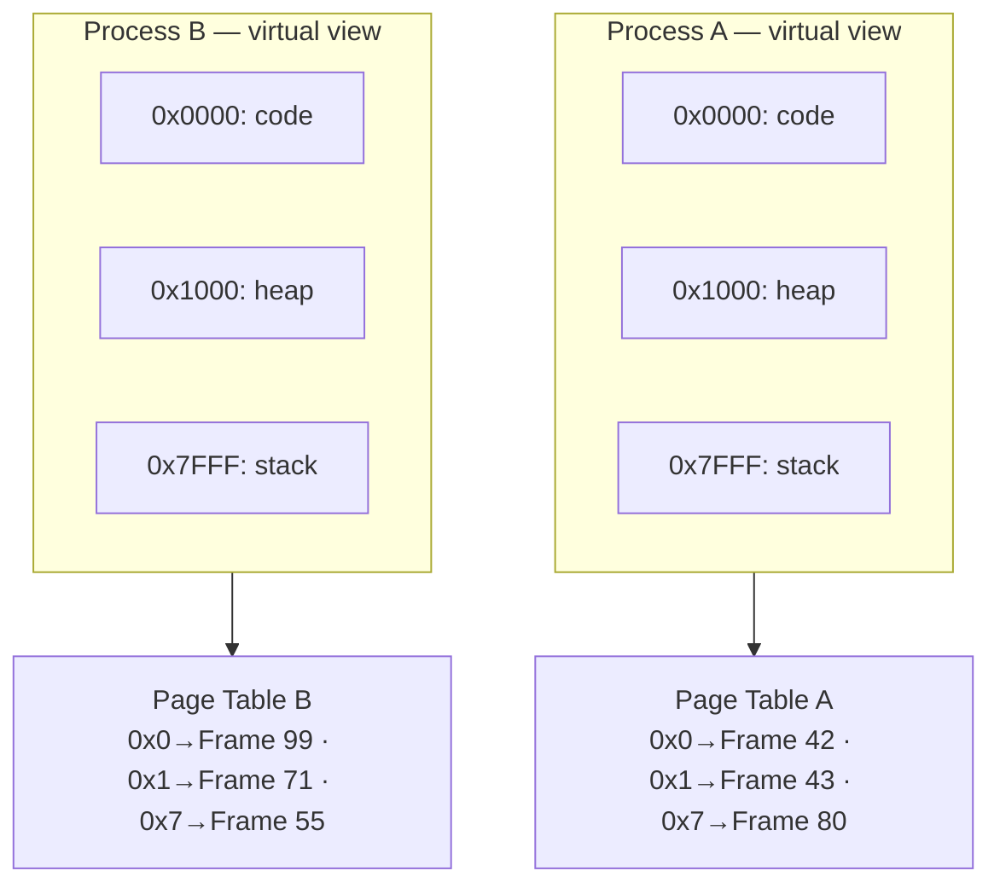
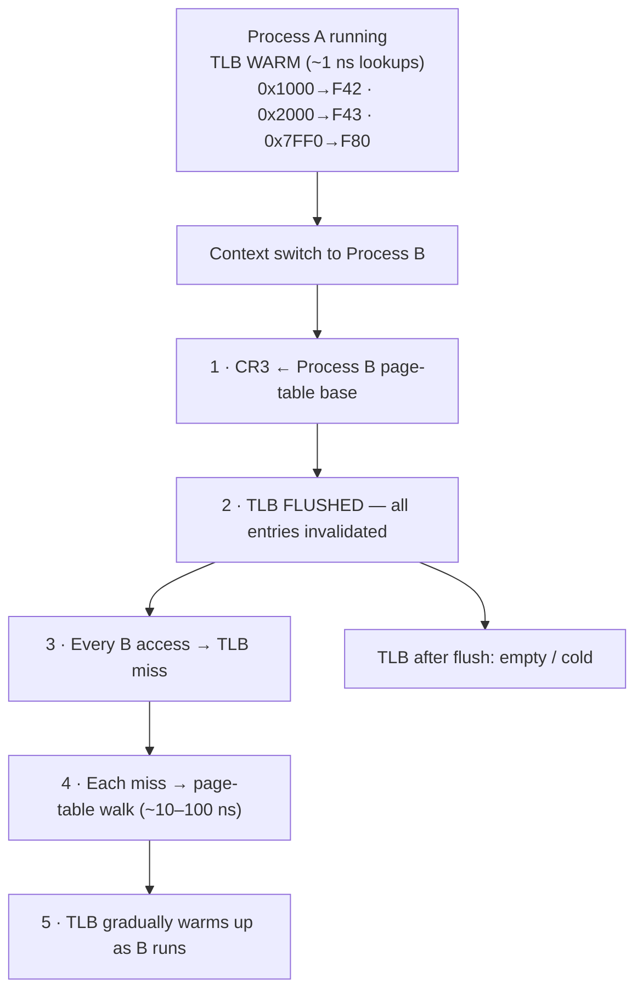
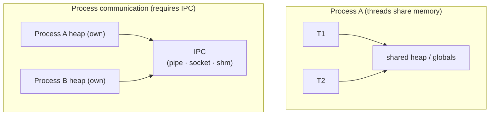
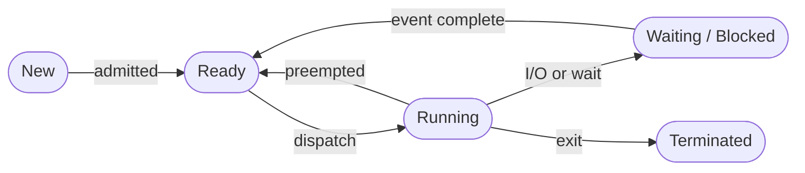
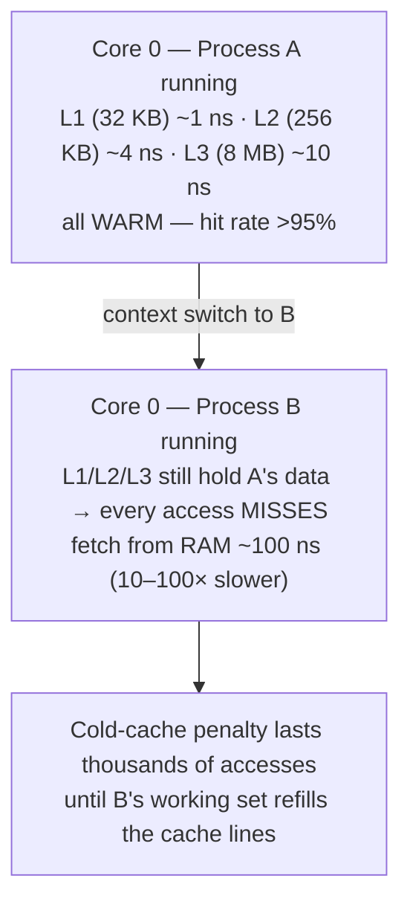
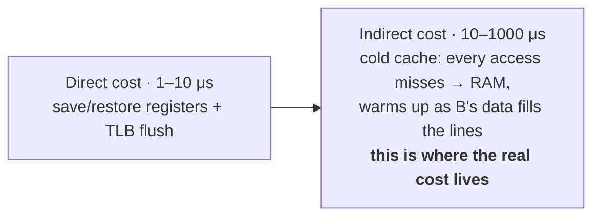
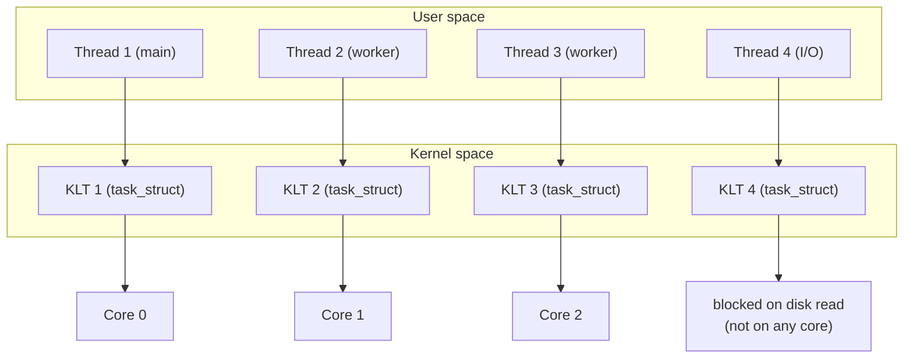
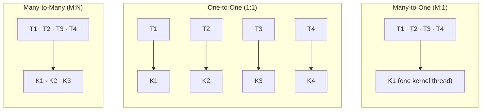
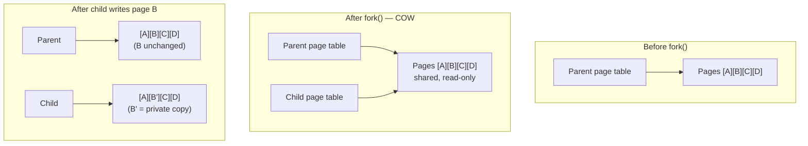

# ⚡ Processes & Threads

---

## 1. Process vs Thread

| Aspect | Process | Thread |
|--------|---------|--------|
| **Definition** | Independent program in execution | Lightweight unit of execution within a process |
| **Memory** | Own address space (code, data, heap, stack) | Shares address space with other threads in the same process |
| **Creation cost** | Expensive (new address space, page tables) | Cheap (shares most resources with parent process) |
| **Context switch** | Expensive (TLB flush, page table swap) | Cheaper (shared address space, no TLB flush needed) |
| **Communication** | IPC required (pipes, sockets, shared memory) | Direct shared memory access |
| **Isolation** | Strong — crash in one process doesn't affect others | Weak — a bug in one thread can crash the entire process |
| **Overhead** | Higher memory and CPU overhead | Lower overhead |
| **Example** | Chrome tabs (multi-process), microservices | Java threads, pthreads within a single application |

:::tip Senior-Level Insight
Chrome deliberately uses **multi-process architecture** — each tab is a separate process. This means a crash in one tab doesn't take down the browser. The trade-off is higher memory usage. Firefox historically used threads and later moved toward multi-process (Electrolysis/Fission).
:::

### Deep Dive: Key Concepts from the Comparison Table

#### Page Table Swap — Why Process Switches Are Expensive

Every process has its own **page table** — a kernel data structure that maps virtual addresses to physical memory frames. This is what gives each process the illusion of having its own private address space.

Both processes use the **same virtual addresses**, but their page tables map them to **different physical frames**:



When the OS switches from Process A to Process B, it must **swap the active page table** by loading Process B's page table base address into the CPU's **CR3 register** (on x86). After this, every memory access by the CPU goes through the new page table, so Process B sees its own memory — not Process A's.

**Threads within the same process share a single page table**, so switching between threads skips this step entirely.

#### TLB Flush — The Hidden Performance Killer

The **TLB (Translation Lookaside Buffer)** is a small, extremely fast hardware cache inside the CPU that stores recent virtual-to-physical address translations. Without it, every memory access would require a slow multi-level page table walk through RAM.



**Why flush?** Because TLB entries from Process A map Process A's virtual addresses to Process A's physical frames. If Process B reused those entries, virtual address `0x1000` would resolve to Process A's physical memory — a catastrophic security and correctness violation.

**Why threads don't trigger a TLB flush:** Threads within the same process share the same page table. Virtual address `0x1000` maps to the same physical frame regardless of which thread is running, so cached TLB entries remain valid.

```
Process switch: CR3 change → TLB flush → cold cache → thousands of misses
Thread  switch: No CR3 change → TLB stays warm → no miss penalty
```

:::info PCID Optimization (Modern CPUs)
Modern x86 CPUs support **Process-Context Identifiers (PCID)**, which tag each TLB entry with a process ID. This avoids full TLB flushes — entries from Process A simply aren't matched when Process B is running. Linux enabled PCID support in kernel 4.14, significantly reducing context switch overhead.
:::

#### IPC Required — Why Processes Can't Just Share Memory

Because each process has its **own virtual address space** (enforced by separate page tables), one process cannot directly read or write another process's memory. This isolation is intentional — it prevents bugs in one process from corrupting another and provides a security boundary.

**Threads** share one address space (fast, but risks race conditions). **Processes** are isolated and must go through the kernel via IPC (slower, but safe):



The five main IPC mechanisms, ordered by typical use case:

| Mechanism | How It Works | Latency | When To Use |
|-----------|-------------|---------|-------------|
| **Shared Memory** | Kernel maps the same physical frames into both processes' page tables. Fastest IPC — no kernel involvement after setup, but requires explicit synchronization (mutexes/semaphores). | ~ns (same as memory access) | High-throughput data sharing (database engines, video processing) |
| **Pipe** | Kernel-managed byte stream buffer. One end writes, other end reads. Data flows through kernel space. | ~μs | Simple parent-child streaming (`ls \| grep`) |
| **Unix Socket** | Bidirectional byte stream via filesystem path. Full-duplex. Can pass file descriptors between processes. | ~μs | General-purpose IPC with protocol framing |
| **Message Queue** | Kernel-managed queue with message boundaries and optional priorities. | ~μs | Decoupled producer-consumer, when you need message framing |
| **Signal** | Asynchronous notification — just a number, no payload. | ~μs | Lightweight events (`SIGHUP` for config reload, `SIGTERM` to stop) |

:::warning Thread Shared Memory Isn't Free Either
While threads can share memory directly, this introduces **race conditions**, **deadlocks**, and **visibility issues** (CPU caches may hold stale values). You still need synchronization primitives — `synchronized`, `volatile`, `Atomic*`, or `Lock`. The advantage over IPC is performance: no kernel crossing, no serialization, just memory reads/writes guarded by locks.
:::

---

## 2. Process States

A process transitions through these states during its lifecycle:



| State | Description |
|-------|-------------|
| **New** | Process is being created |
| **Ready** | Loaded in memory, waiting for CPU assignment |
| **Running** | Instructions are being executed on a CPU core |
| **Waiting (Blocked)** | Waiting for an event — I/O completion, signal, resource availability |
| **Terminated** | Execution finished; process awaits cleanup by parent (zombie until `wait()` called) |

### Key Transitions

| Transition | Trigger |
|-----------|---------|
| New → Ready | Process admitted by long-term scheduler |
| Ready → Running | Short-term scheduler dispatches process to CPU |
| Running → Ready | Timer interrupt (preemption) or higher-priority process arrives |
| Running → Waiting | I/O request, `wait()` call, or semaphore/lock acquisition |
| Waiting → Ready | I/O completes, signal received, lock released |
| Running → Terminated | `exit()` call, unhandled signal (`SIGKILL`), or normal completion |

---

## 3. Process Control Block (PCB)

The PCB (also called Task Control Block in Linux: `task_struct`) is the kernel data structure that represents a process.

| PCB Field | Detail |
|-----------|--------|
| **PID** | Process ID |
| **Process State** | ready / running / waiting … |
| **Program Counter** | address of next instruction |
| **CPU Registers** | saved register file |
| **CPU Scheduling Info** | priority, queue pointers |
| **Memory Management** | page-table base register · segment table · memory limits |
| **I/O Status** | open file table |
| **Accounting Info** | CPU time used |
| **Parent PID / Child list** | process hierarchy |
| **Signal handlers** | registered handlers |
| **Credentials** | uid, gid |

In Linux, inspect a running process's PCB via `/proc/<pid>/`:
```bash
# Key files in /proc/<pid>/
cat /proc/1234/status    # State, PID, PPid, memory, threads
cat /proc/1234/maps      # Memory mappings
cat /proc/1234/fd        # Open file descriptors
cat /proc/1234/stat      # Raw scheduling info
```

---

## 4. Context Switching

A **context switch** is the mechanism by which the OS saves the state of the currently running process/thread and loads the state of the next one to run.

### What Happens During a Context Switch

```
1. Timer interrupt / syscall / I/O triggers switch
2. Save CPU registers of current process into its PCB
3. Save program counter
4. Update process state (Running → Ready/Waiting)
5. Select next process (scheduler decision)
6. Load PCB of new process (registers, PC)
7. Update memory management (switch page tables → TLB flush)
8. Resume execution of new process
```

### Why Context Switching is Expensive

| Cost Factor | Impact |
|-------------|--------|
| **Direct CPU time** | Saving/restoring registers — typically 1–10 μs |
| **TLB flush** | All cached virtual→physical translations invalidated (process switch, not thread switch) |
| **Cache pollution** | New process has different working set → L1/L2/L3 cache misses (cold cache) |
| **Pipeline flush** | CPU instruction pipeline must be drained |
| **Indirect cost** | Biggest cost — lost cache warmth can slow the new process for thousands of cycles |

### Indirect Cache Effects — Why the Real Cost Is 10–100× Worse

The direct cost of a context switch (saving/restoring registers) is only ~1–10 μs. But the **indirect cost** — caused by destroying cache warmth — can add 10–1000 μs of slowdown. This is the dominant cost and is often misunderstood.



The timeline of a typical context switch:



| Cost Component | Latency | What Happens |
|----------------|---------|-------------|
| Register save/restore | ~1 μs | CPU copies ~100 registers to/from PCB in memory |
| TLB flush | ~1 μs | All address translations invalidated; first accesses cause page table walks |
| Pipeline flush | ~0.1 μs | In-flight instructions discarded; pipeline refills from new PC |
| **L1 cache cold** | **~10–50 μs** | **32 KB of A's data evicted as B loads its working set (~1 ns → ~100 ns per access)** |
| **L2/L3 cache cold** | **~50–500 μs** | **B's larger working set (KB–MB) must be fetched from RAM** |
| **Branch predictor cold** | **~10–100 μs** | **CPU's branch prediction tables trained on A's code patterns are useless for B** |

:::tip How High-Performance Systems Avoid This
**DPDK** (Data Plane Development Kit) and **kernel-bypass networking** (used by high-frequency trading, telecom) avoid context switches by:

1. **Thread pinning** (`taskset`, `pthread_setaffinity_np`) — bind a thread to a specific CPU core so it never gets switched out. The cache stays warm forever.
2. **Busy-polling** — instead of blocking on I/O (which triggers a context switch), the thread continuously polls for new data in a tight loop. Burns CPU but eliminates switch overhead.
3. **Kernel bypass** — skip the kernel's network stack entirely. The NIC (network card) writes packets directly into user-space memory via DMA. No syscalls, no kernel threads, no context switches.

The trade-off: you dedicate entire CPU cores to a single task (no sharing). This only makes sense when latency matters more than CPU efficiency — e.g., processing 10M+ packets/second or sub-microsecond trading.
:::

:::tip 🔌 Why It Matters in Your SE Role
This is the theory behind **thread-pool sizing** — a decision you make every time you configure an `ExecutorService`, a web server's worker count, or a DB connection pool. Oversizing the pool doesn't make things faster; past the core count, threads just fight for the CPU and you pay the context-switch + cold-cache tax on every switch. Rules of thumb you can actually use:

- **CPU-bound work** (hashing, compression, JSON parsing): pool size ≈ number of cores. More threads = more switching, not more throughput.
- **I/O-bound work** (DB calls, HTTP fanout): you can go higher, since threads spend most of their time blocked. Little's Law gives the real target: `threads ≈ target_throughput × avg_latency`.
- **Watch `vmstat 1`** — the `cs` (context switches/sec) column spiking into the hundreds-of-thousands while CPU sits idle is the classic "too many threads / lock contention" signature.
:::

---

## 5. Thread Models

### User-Level vs Kernel-Level Threads

| Aspect | User-Level Threads (ULT) | Kernel-Level Threads (KLT) |
|--------|--------------------------|---------------------------|
| **Managed by** | User-space thread library | OS kernel |
| **Kernel awareness** | Kernel sees only the process | Kernel schedules each thread individually |
| **Context switch** | Very fast (no kernel involvement) | Slower (requires syscall/trap to kernel) |
| **Blocking I/O** | Blocks entire process (unless using async I/O) | Only the calling thread blocks |
| **Multicore** | Cannot use multiple cores (kernel sees one entity) | True parallelism on multiple cores |
| **Example** | Green threads (early Java), GNU Portable Threads | pthreads, Java native threads, Windows threads |

#### Kernel Threads Explained

A **kernel thread** (KLT) is a thread that the OS kernel knows about and schedules directly. When you create a `pthread` in C or a `Thread` in Java, the OS creates a corresponding kernel-level scheduling entity. The kernel's scheduler treats each kernel thread as an independent unit that can be assigned to any available CPU core.

Java app: 1 process, 4 threads. Each user thread maps 1:1 to a kernel thread (`task_struct`); the kernel scheduler places each on a core independently. Thread 4 is blocked on I/O, so only it sleeps:



**Why "kernel" thread?** Because crossing into kernel space is required for key operations:

```
Kernel thread calls read():
  1. Thread executes syscall instruction        ← trap to kernel mode
  2. Kernel sees which KLT made the call        ← knows exactly which thread
  3. Kernel marks THIS KLT as "blocked"         ← only this thread sleeps
  4. Kernel schedules a different KLT on core   ← other threads keep running
  5. When I/O completes, kernel wakes this KLT  ← thread resumes
```

Compare this to a **user-level thread**, where the kernel has no idea individual threads exist:

```
User-level thread calls read():
  1. Syscall traps to kernel                    ← trap to kernel mode
  2. Kernel sees only THE PROCESS               ← doesn't know about threads
  3. Kernel blocks THE ENTIRE PROCESS           ← ALL user threads stop
  4. No other user-level thread can run         ← everything frozen
  5. When I/O completes, process resumes        ← all threads unfreeze
```

| Kernel Thread Advantage | Why It Matters |
|------------------------|----------------|
| **Independent scheduling** | Kernel puts each thread on a separate core — true parallelism |
| **Independent blocking** | One thread doing `read()` doesn't freeze the others |
| **Preemption** | Kernel can forcibly stop a thread that's hogging the CPU (timer interrupt) |
| **Priority** | Kernel can assign different priorities to different threads in the same process |

| Kernel Thread Disadvantage | Why It Costs |
|---------------------------|-------------|
| **Creation overhead** | Each thread needs a `task_struct` in kernel memory (~10-20 KB) + kernel stack |
| **Context switch cost** | Switching between KLTs requires a trap to kernel mode (~1-5 us) |
| **Scalability limit** | Creating 100K+ kernel threads exhausts kernel memory; each costs ~1 MB stack |
| **Syscall overhead** | Every thread operation (create, join, sync) crosses the user-kernel boundary |

:::info Linux Implementation Detail
In Linux, there is no distinction between processes and threads at the kernel level. Both are represented by a `task_struct`. The `clone()` syscall creates a new `task_struct` -- the flags determine what is shared:
- `clone(CLONE_VM | CLONE_FS | CLONE_FILES | CLONE_SIGHAND)` creates a thread (shares address space, filesystem, file descriptors, signals)
- `fork()` creates a process (copies everything, with COW for memory)

So a "kernel thread" in Linux is just a `task_struct` that shares its parent's memory (`CLONE_VM`).
:::

### Multi-threading Models



- **M:1** — fast switches, no parallelism, one block blocks all.
- **1:1** — true parallelism, higher overhead, scalable.
- **M:N** — best of both, complex to implement (Go goroutines, Erlang processes).

| Model | Parallelism | Blocking Impact | Overhead | Example |
|-------|------------|----------------|----------|---------|
| **Many-to-One** | ❌ | One blocks all | Low | Early Green threads |
| **One-to-One** | ✅ | Only one thread blocks | High | Linux pthreads, Java (HotSpot) |
| **Many-to-Many** | ✅ | Flexible | Medium | Go goroutines, Erlang, Solaris LWP |

---

## 6. Concurrency vs Parallelism

| | Concurrency (single core) | Parallelism (multi-core) |
|---|---|---|
| **Execution** | tasks interleaved — only one runs at a time | tasks run at the exact same instant |
| **Cores** | Core 0 time-slices: `T1 · T2 · T1 …` | Core 0, Core 1, Core 2 each run a task |
| **Idea** | dealing with many things at once | doing many things at once |

| Concept | Definition | Requires Multiple Cores? |
|---------|-----------|------------------------|
| **Concurrency** | Managing multiple tasks that make progress over overlapping time periods | No — can be achieved via time-slicing |
| **Parallelism** | Executing multiple tasks at the exact same instant | Yes — requires multiple CPU cores |

:::info
Rob Pike's famous quote: *"Concurrency is about dealing with lots of things at once. Parallelism is about doing lots of things at once."* Concurrency is a design pattern; parallelism is an execution model.
:::

---

## 7. Green Threads, Coroutines, and Fibers

| Concept | Scheduled By | Preemptive? | Stack | Example |
|---------|-------------|-------------|-------|---------|
| **OS Thread** | Kernel | Yes | Fixed (1–8 MB) | pthreads, Java threads |
| **Green Thread** | User-space runtime | Yes (runtime decides) | Small, growable | Early Java, Ruby MRI |
| **Coroutine** | Programmer (`yield`) | No (cooperative) | Very small / stackless possible | Python `asyncio`, Kotlin coroutines |
| **Fiber** | User-space library | No (cooperative) | Small, growable | Ruby Fibers, Windows Fibers |
| **Goroutine** | Go runtime (M:N) | Yes (runtime preemption since Go 1.14) | Small (2–8 KB, growable) | Go |

:::tip Why This Matters
Go goroutines are a huge advantage: you can spawn millions (each starts at ~2 KB stack) with M:N scheduling across OS threads. Compare that to Java where each `Thread` maps 1:1 to an OS thread (~1 MB stack). **Project Loom** (Java 21+) introduces virtual threads to fix this gap.
:::

---

## 8. fork() System Call

`fork()` creates a new process by duplicating the calling process.

```c
#include <stdio.h>
#include <unistd.h>
#include <sys/wait.h>

int main() {
    printf("Parent PID: %d\n", getpid());

    pid_t pid = fork();

    if (pid < 0) {
        perror("fork failed");
        return 1;
    } else if (pid == 0) {
        // Child process
        printf("Child PID: %d, Parent PID: %d\n", getpid(), getppid());
        execl("/bin/ls", "ls", "-la", NULL);  // Replace child with ls
    } else {
        // Parent process
        printf("Parent: created child %d\n", pid);
        int status;
        waitpid(pid, &status, 0);  // Wait for child to finish
        printf("Child exited with status %d\n", WEXITSTATUS(status));
    }
    return 0;
}
```

### Copy-on-Write (COW)

After `fork()`, the child does **not** immediately copy the parent's entire address space. Instead:



1. Both parent and child share the **same physical pages**, marked **read-only**
2. When either process tries to **write**, a page fault occurs
3. The kernel copies just **that one page** and updates the page table
4. This makes `fork()` nearly instant, even for large processes

:::warning vfork()
`vfork()` is even cheaper — the child **shares** the parent's address space (no COW) and the parent is **suspended** until the child calls `exec()` or `_exit()`. Use with extreme caution — writing to any variable in the child corrupts the parent's state.
:::

---

## 9. Inter-Process Communication (IPC)

### IPC Mechanisms

#### Pipes (Anonymous)
```c
int fd[2];
pipe(fd);       // fd[0] = read end, fd[1] = write end
pid_t pid = fork();

if (pid == 0) {
    close(fd[1]);                       // Child closes write end
    char buf[100];
    read(fd[0], buf, sizeof(buf));      // Child reads from pipe
    printf("Child received: %s\n", buf);
    close(fd[0]);
} else {
    close(fd[0]);                       // Parent closes read end
    write(fd[1], "Hello child!", 12);   // Parent writes to pipe
    close(fd[1]);
    wait(NULL);
}
```

#### Named Pipes (FIFOs)
```bash
mkfifo /tmp/myfifo
echo "Hello" > /tmp/myfifo &    # Writer blocks until reader connects
cat /tmp/myfifo                  # Reader
```

#### Message Queues (POSIX)
```c
#include <mqueue.h>

// Sender
mqd_t mq = mq_open("/myqueue", O_CREAT | O_WRONLY, 0644, NULL);
mq_send(mq, "Hello", 5, 0);

// Receiver
mqd_t mq = mq_open("/myqueue", O_RDONLY);
char buf[256];
mq_receive(mq, buf, 256, NULL);
```

#### Shared Memory
```c
#include <sys/mman.h>
#include <fcntl.h>

int fd = shm_open("/myshm", O_CREAT | O_RDWR, 0666);
ftruncate(fd, 4096);
void *ptr = mmap(NULL, 4096, PROT_READ | PROT_WRITE, MAP_SHARED, fd, 0);

// Now multiple processes can read/write through ptr
// Needs synchronization (semaphore/mutex) for safe access!
sprintf(ptr, "Shared data!");
```

#### Sockets (Unix Domain)
```c
// Server
int server_fd = socket(AF_UNIX, SOCK_STREAM, 0);
struct sockaddr_un addr = { .sun_family = AF_UNIX, .sun_path = "/tmp/mysock" };
bind(server_fd, (struct sockaddr*)&addr, sizeof(addr));
listen(server_fd, 5);
int client_fd = accept(server_fd, NULL, NULL);

// Client
int sock = socket(AF_UNIX, SOCK_STREAM, 0);
connect(sock, (struct sockaddr*)&addr, sizeof(addr));
```

#### Signals
```c
#include <signal.h>

void handler(int sig) {
    printf("Caught signal %d\n", sig);
}

int main() {
    signal(SIGUSR1, handler);   // Register handler
    // ... process runs ...
    kill(target_pid, SIGUSR1);  // Send signal to another process
}
```

### IPC Comparison Table

| Mechanism | Direction | Related Processes Only? | Speed | Data Size | Persistence | Use Case |
|-----------|----------|------------------------|-------|-----------|-------------|----------|
| **Pipe** | Unidirectional | Yes (parent-child) | Fast | Stream | No | Simple parent-child communication |
| **Named Pipe (FIFO)** | Unidirectional | No | Fast | Stream | Filesystem entry | Unrelated processes, shell pipelines |
| **Message Queue** | Bidirectional | No | Medium | Structured messages | Kernel-persisted | Decoupled producer-consumer |
| **Shared Memory** | Bidirectional | No | **Fastest** | Arbitrary | Kernel-persisted | High-throughput data sharing |
| **Socket (Unix)** | Bidirectional | No | Fast | Stream/Datagram | No | General-purpose, also works over network |
| **Socket (TCP/UDP)** | Bidirectional | No | Slower (network stack) | Stream/Datagram | No | Cross-machine communication |
| **Signal** | Unidirectional | No | Fast | Tiny (signal number) | No | Notifications, interrupts |

:::tip When to Use What
- **Shared memory** → maximum throughput (e.g., database engines, video processing)
- **Unix sockets** → general-purpose IPC with well-defined protocol
- **Pipes** → simple parent-child streaming
- **Signals** → lightweight notifications (SIGHUP for config reload)
- **Message queues** → when you need message boundaries and priorities
:::

---

## 🛠️ Applying This in Your SE Role

You rarely call `fork()` or `clone()` by hand. But the process/thread model is the hidden machinery behind decisions you make constantly — and behind the production incidents you'll be paged for.

### Where this shows up in everyday work

| You're doing this… | …and the process/thread concept driving it is |
|--------------------|------------------------------------------------|
| Setting `server.tomcat.threads.max`, Gunicorn `--workers`, or an `ExecutorService` size | Context-switch cost & the CPU-bound vs I/O-bound distinction |
| Picking **virtual threads** (Java 21 / Loom) or **goroutines** for a high-fanout service | M:N scheduling — millions of cheap user threads over a few OS threads |
| Choosing a **multi-process** worker model (Gunicorn, Unicorn, nginx, Chrome) | Isolation: one crashed worker doesn't take down the rest |
| Sharing state between workers via **Redis / shared memory** instead of in-process | Processes don't share an address space — you need IPC |
| Debugging an OOM after a traffic spike | Each OS thread reserves ~1 MB of stack; thread-per-request doesn't scale |
| Reading `SIGTERM` handling in a graceful-shutdown hook | Signals are the lightweight IPC your orchestrator (k8s) uses to stop pods |

### What to actually do

- **Default to a bounded pool, never unbounded thread-per-task.** An unbounded pool under a traffic spike is a self-inflicted OOM (each thread = ~1 MB stack + a `task_struct`).
- **Match the pool to the workload.** Mixing CPU-bound and I/O-bound work in one pool starves both — give them separate pools.
- **Inside containers, check what "cores" means.** A JVM or Go runtime that sees the *host's* 64 cores while your pod is capped at 2 CPUs will size its pools 32× too large. Set `GOMAXPROCS` / `-XX:ActiveProcessorCount` to the cgroup limit (modern runtimes mostly do this now, but verify).
- **Reach for multi-process when you need a fault/security boundary**, and threads (or virtual threads) when you need cheap concurrency with shared state.

:::warning 🔥 War Story — The Thread-Per-Request Service That Only Died in Production
A payments service used a classic `new Thread(handler).start()` per incoming request. It sailed through code review and load tests (which capped at ~200 concurrent requests). On the first real promo day, traffic hit ~8,000 concurrent in-flight requests. Each thread reserved ~1 MB of stack, so the JVM tried to reserve ~8 GB of thread stacks alone — on a 4 GB pod. The result wasn't a slow service; it was `OutOfMemoryError: unable to create new native thread`, then a crash loop, then a cascading failure as retries piled onto the remaining replicas.

**Root cause:** unbounded concurrency × per-thread stack cost — exactly the "creation overhead / scalability limit" rows in the kernel-thread table above. **Fix:** a bounded pool sized from Little's Law (`~throughput × latency`), plus a queue with backpressure that sheds load instead of spawning threads. The deeper fix shipped later: virtual threads, so the per-task cost dropped from ~1 MB to a few KB and the bound could be raised safely. The lesson — *the OS makes thread creation look cheap until the exact moment it isn't, and that moment is always peak traffic.*
:::

---

## 🔥 Interview Questions

### Conceptual

1. **What is the difference between a process and a thread?** Explain with examples and trade-offs.
2. **Why is context switching expensive?** Go beyond the direct cost — discuss cache effects.
3. **Explain Copy-on-Write in fork(). Why is it important?** What happens without it?
4. **What is a zombie process? How do you prevent them?** (Answer: call `wait()`/`waitpid()`, or use `SIGCHLD` handler with `SA_NOCLDWAIT`)
5. **Why might you choose processes over threads?** (Isolation, fault tolerance, security sandboxing)

### Scenario-Based

6. **You call fork() in a multi-threaded program. What happens?** (Only the calling thread is duplicated in the child — other threads vanish. This is why fork + threads is dangerous.)
7. **A server handles 10K concurrent connections. Would you use threads or processes?** (Neither naively — use event-driven I/O with epoll/kqueue, or goroutines/virtual threads)
8. **How does Chrome's multi-process architecture improve security?** (Each renderer runs in a sandboxed process — even if compromised, it can't access other tabs' memory)

### Quick Recall

| Question | Answer |
|----------|--------|
| Typical thread stack size | 1–8 MB (Linux default: 8 MB) |
| Goroutine initial stack size | 2–8 KB (growable) |
| Context switch time | ~1–10 μs (direct), plus cache effects |
| Max PIDs on Linux | Default 32768, configurable up to 4M (`/proc/sys/kernel/pid_max`) |
| fork() return value in child | 0 |
| fork() return value in parent | Child's PID |
