# 🧠 Memory Management

Memory management is one of the most critical OS responsibilities — it determines how programs share limited physical memory, provides isolation between processes, and enables programs larger than physical RAM to run.

---

## 1. Memory Hierarchy

From fastest/smallest (top) to slowest/largest (bottom):

| Level | Access latency | Typical size |
|-------|----------------|--------------|
| **CPU Registers** | ~0.3 ns | bytes |
| **L1 Cache** | ~1 ns | 32–64 KB per core |
| **L2 Cache** | ~4 ns | 256 KB–1 MB per core |
| **L3 Cache** | ~10 ns | 8–64 MB shared |
| **DRAM** | ~100 ns | 8–256 GB |
| **SSD** | ~100 μs | 256 GB–8 TB |
| **HDD** | ~10 ms | 1–20 TB |

### ⚡ Latency Numbers Every Programmer Should Know

| Operation | Latency | Scaled (if L1 = 1 sec) |
|-----------|---------|----------------------|
| L1 cache reference | 1 ns | 1 sec |
| Branch mispredict | 3 ns | 3 sec |
| L2 cache reference | 4 ns | 4 sec |
| Mutex lock/unlock | 17 ns | 17 sec |
| L3 cache reference | 10 ns | 10 sec |
| Main memory (DRAM) | 100 ns | 1.5 min |
| Compress 1 KB (Snappy) | 3 μs | 50 min |
| SSD random read | 16 μs | 4.5 hours |
| Read 1 MB sequentially from memory | 3 μs | 50 min |
| Read 1 MB sequentially from SSD | 49 μs | 13.5 hours |
| Round trip within same datacenter | 500 μs | 5.8 days |
| Read 1 MB sequentially from HDD | 825 μs | 9.5 days |
| Disk seek (HDD) | 2 ms | 23 days |
| Send packet CA → Netherlands → CA | 150 ms | 4.8 years |

:::tip
Memorize the order of magnitude: **registers < L1 < L2 < L3 < RAM < SSD < HDD < Network**. Every level is roughly **10× slower** than the one above it.
:::

---

## 2. Address Space and Contiguous Allocation

### Process Memory Layout

From high address (top, `0xFFFFFFFF`) down to low address (`0x00000000`):

| Region | Contents |
|--------|----------|
| **Kernel Space** | not accessible in user mode |
| **Stack** ↓ | local variables, function frames — *grows downward* |
| *(gap)* | unused address range between stack and heap |
| **Heap** ↑ | dynamic allocation (`malloc`) — *grows upward* |
| **BSS** | uninitialized global variables |
| **Data** | initialized global variables |
| **Text (Code)** | executable instructions (read-only) |

### Contiguous Memory Allocation

In early systems, each process was allocated a single contiguous block of memory.

**Allocation strategies:**

| Strategy | Description | Pros | Cons |
|----------|-------------|------|------|
| **First Fit** | Allocate first block large enough | Fast | Fragments start of memory |
| **Best Fit** | Smallest block that fits | Minimizes wasted space | Slow (search all), leaves tiny fragments |
| **Worst Fit** | Largest available block | Leaves large remainder | Slow, poor utilization |

---

## 3. Fragmentation

| Type | Description | Occurs In | Solution |
|------|-------------|-----------|----------|
| **Internal** | Allocated block is larger than needed → wasted space inside the block | Fixed-size partitions, paging | Smaller allocation units |
| **External** | Total free memory is enough, but it's scattered in non-contiguous blocks | Variable-size partitions, segmentation | Compaction, paging |

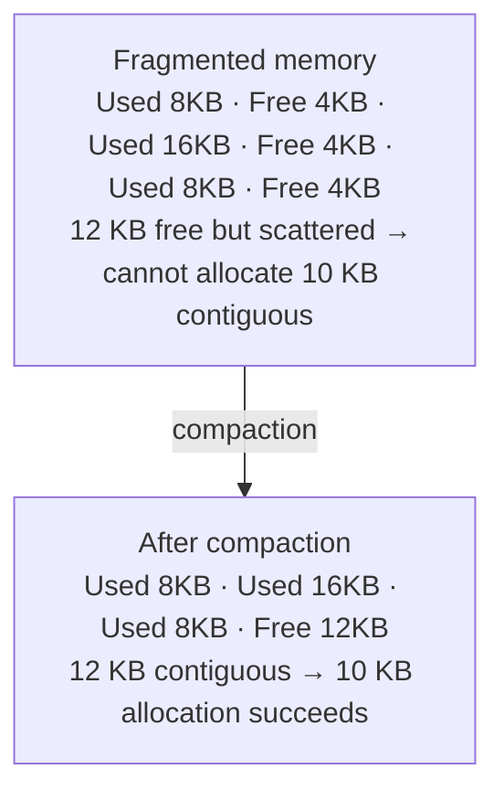

---

## 4. Paging

Paging eliminates external fragmentation by dividing memory into fixed-size blocks.

- **Page**: fixed-size block of virtual memory (typically 4 KB)
- **Frame**: fixed-size block of physical memory (same size as a page)
- **Page Table**: maps virtual page numbers → physical frame numbers

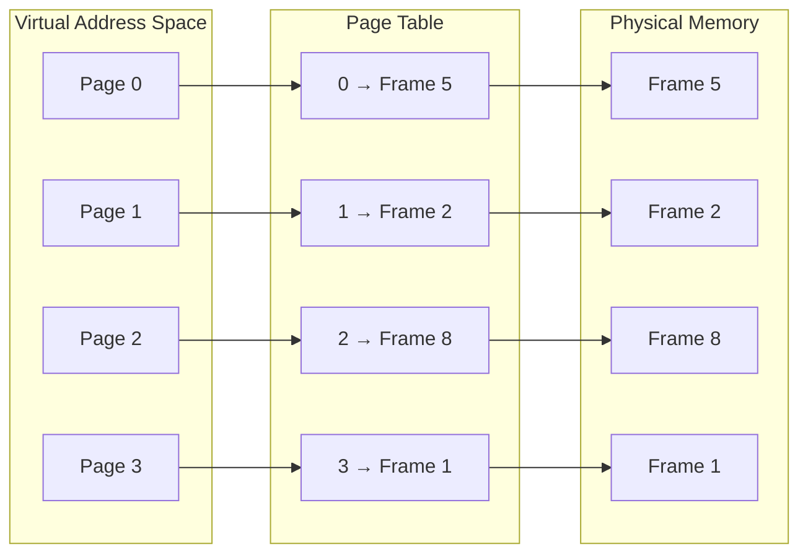

### Virtual Address Translation

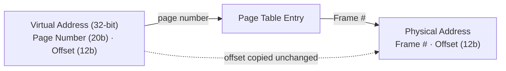

**Page Table Entry (PTE) fields:**

| Field | Purpose |
|-------|---------|
| Frame number | Physical frame location |
| Valid/present bit | Is the page currently in physical memory? |
| Protection bits | Read/write/execute permissions |
| Dirty bit | Has the page been modified? |
| Reference bit | Has the page been accessed recently? (used by replacement algorithms) |

### Multi-Level Page Tables

A flat page table for 32-bit addresses with 4 KB pages requires 2^20 entries × 4 bytes = **4 MB per process**. Multi-level page tables solve this by only allocating page table pages that are actually needed.

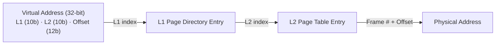

**64-bit systems use 4 or 5 levels** (x86-64 uses 4-level: PML4 → PDPT → PD → PT).

### Page Table Walk — What Actually Happens

A page table walk is **not** a linear scan of every entry. The virtual address itself contains the index for each level, so the hardware jumps directly to the right entry at each step. Think of it like a multi-level directory lookup, not a search.

#### 2-Level Walk (32-bit, 4 KB pages)

Translating virtual address `0x00403004` → split into `L1 = 0x001 (1)`, `L2 = 0x003 (3)`, `Offset = 0x004 (4)`, then walk the tree (each hop is a ~100 ns RAM read):

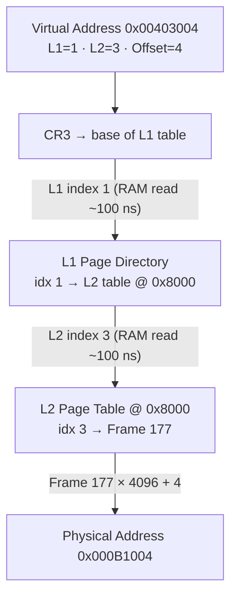

Each level is an **indexed array lookup**, not a search — the address bits select the entry directly.

Each level is just an **array lookup by index** — not a search. The hardware uses bits from the virtual address as array indices.

#### 4-Level Walk (64-bit x86-64)

Modern 64-bit systems use 4 levels, meaning **4 sequential RAM reads** per translation:

Virtual address uses 48 of 64 bits, split into four 9-bit indices plus a 12-bit offset. Each level is a sequential RAM read:

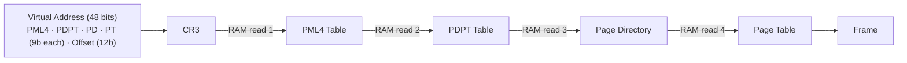

Total walk: **~400 ns** (4 × RAM access) vs. a **~1 ns** TLB hit — 400× slower, which is exactly why the TLB exists.

#### Why Not a Flat Table?

A **flat** table for a 48-bit address space (4 KB pages) would need 2³⁶ entries × 8 bytes = **512 GB per process** — larger than RAM. A **multi-level** table only allocates the branches a process actually uses; unallocated entries are null pointers, so nothing is wasted:

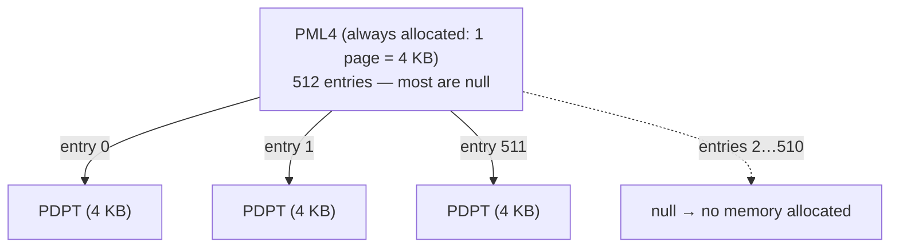

A process using ~100 MB needs only ~25 page-table pages (~100 KB), versus 512 GB for a flat table.

#### Summary: Page Table Walk is NOT a Search

| Misconception | Reality |
|--------------|---------|
| "Scan every entry to find the matching address" | Each level is an **indexed array lookup** — the address bits tell you exactly which entry to read |
| "One big table" | Multi-level tree; only branches that map real memory are allocated |
| "Happens on every memory access" | The TLB caches recent translations; walks only happen on TLB misses (&lt;1% of accesses) |
| "Software does the walk" | The **MMU hardware** does it automatically; the OS only sets up the tables and handles page faults |

### TLB — Translation Lookaside Buffer

The TLB is a **hardware cache** for page table entries, avoiding the multi-level page table walk on every memory access.

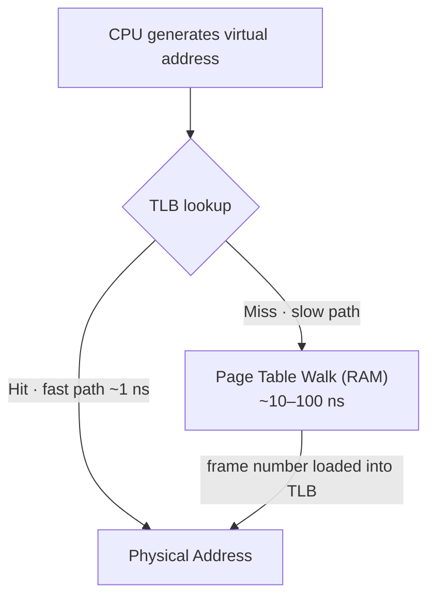

| Metric | Typical Value |
|--------|--------------|
| TLB entries | 64–1024 per core |
| TLB hit rate | >99% for well-behaved programs |
| TLB miss penalty | 10–100 ns (page table walk) |
| TLB flush | On process context switch (PCID can mitigate) |

:::warning Huge Pages
Standard 4 KB pages mean a 1 GB working set needs 262,144 TLB entries — far more than available. **Huge pages** (2 MB or 1 GB) drastically reduce TLB misses. Linux: `madvise(addr, len, MADV_HUGEPAGE)` or transparent huge pages (THP).
:::

---

## 5. Segmentation

Segmentation divides memory into **variable-sized segments** based on logical divisions (code, data, stack, heap).

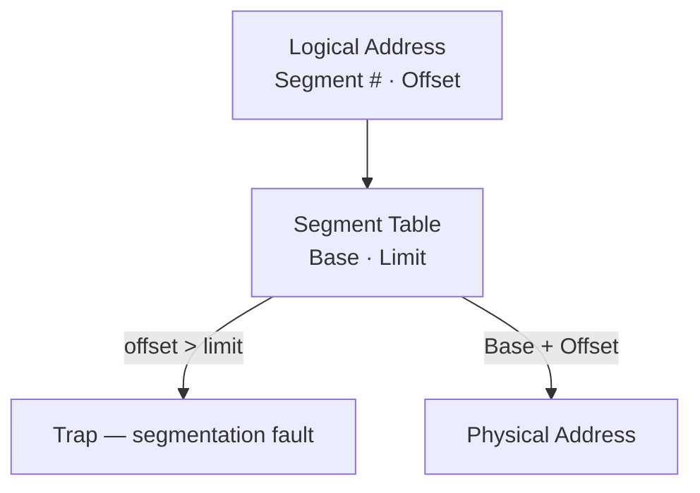

| Aspect | Paging | Segmentation |
|--------|--------|-------------|
| Block size | Fixed (4 KB) | Variable |
| External fragmentation | None | Yes |
| Internal fragmentation | Yes (last page) | None |
| Logical view | No | Yes (code, data, stack) |
| Modern use | Primary mechanism | Largely deprecated (x86-64 uses flat segments) |

---

## 6. Virtual Memory

Virtual memory allows processes to use more memory than physically available by transparently swapping pages between RAM and disk.

### How It Works

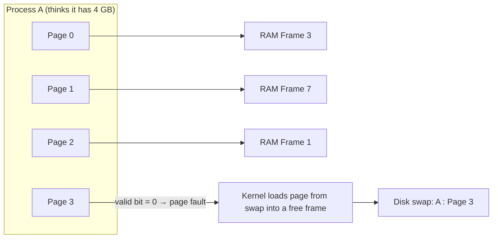

### Demand Paging

Pages are loaded into memory **only when accessed** (not upfront). When a process accesses a page not in memory:

1. CPU generates the virtual address
2. TLB miss → page table walk
3. PTE shows **valid bit = 0** → **page fault** (trap to kernel)
4. Kernel finds the page on disk (swap or file-backed)
5. Kernel loads the page into a free frame (may need to evict another page first)
6. Update PTE: set valid bit, store frame number
7. Restart the faulting instruction

:::info Page Fault Types
- **Minor (soft) fault**: page is already in memory (e.g., in page cache) but not mapped. Just update page table.
- **Major (hard) fault**: page must be read from disk. Very expensive (~1–10 ms).
:::

---

## 7. Page Replacement Algorithms

When physical memory is full and a new page must be loaded, the OS must choose a **victim page** to evict.

### FIFO (First-In, First-Out)

Replace the **oldest** page in memory.

Reference string `7, 0, 1, 2, 0, 3, 0, 4` with 3 frames:

| Reference → | 7 | 0 | 1 | 2 | 0 | 3 | 0 | 4 |
|---|---|---|---|---|---|---|---|---|
| **Frames in memory** | 7 | 7,0 | 7,0,1 | 0,1,2 | 0,1,2 | 1,2,3 | 2,3,0 | 3,0,4 |
| **Result** | Miss | Miss | Miss | Miss | Hit | Miss | Miss | Miss |

→ **7 faults** (evicts the oldest-inserted page each time).

:::warning Belady's Anomaly
FIFO can produce **more** page faults with **more** frames — counterintuitive! This is called Belady's anomaly. Stack-based algorithms (LRU, Optimal) don't suffer from this.
:::

### Optimal (OPT)

Replace the page that **won't be used for the longest time** in the future. Impossible to implement in practice (requires future knowledge) — used as a benchmark.

Reference string `7, 0, 1, 2, 0, 3, 0, 4` with 3 frames:

| Reference → | 7 | 0 | 1 | 2 | 0 | 3 | 0 | 4 |
|---|---|---|---|---|---|---|---|---|
| **Frames in memory** | 7 | 7,0 | 7,0,1 | 0,1,2 | 0,1,2 | 0,2,3 | 0,2,3 | 0,2,4 |
| **Result** | Miss | Miss | Miss | Miss | Hit | Miss | Hit | Miss |

→ **6 faults** (evicts the page used furthest in the future — the theoretical minimum).

### LRU (Least Recently Used)

Replace the page that **hasn't been used for the longest time** — uses past behavior to predict future.

Reference string `7, 0, 1, 2, 0, 3, 0, 4` with 3 frames:

| Reference → | 7 | 0 | 1 | 2 | 0 | 3 | 0 | 4 |
|---|---|---|---|---|---|---|---|---|
| **Frames in memory** | 7 | 7,0 | 7,0,1 | 0,1,2 | 0,1,2 | 0,2,3 | 0,2,3 | 0,3,4 |
| **Result** | Miss | Miss | Miss | Miss | Hit | Miss | Hit | Miss |

→ **6 faults** (evicts the least-recently-used page).

**Implementation:** Exact LRU requires hardware support (timestamp per access) or a doubly-linked list + hash map. Most systems use **approximations**.

### Clock Algorithm (Second Chance)

A practical approximation of LRU using a **reference bit** and a circular buffer.

The clock hand sweeps the circular buffer. `ref=1` pages get a second chance (cleared to 0 and skipped); the first `ref=0` page is evicted:

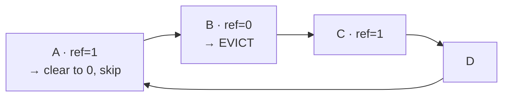

1. Each page has a **reference bit** (set to 1 on access by hardware)
2. Clock hand sweeps circularly
3. If reference bit = 1 → clear it, move on (give a "second chance")
4. If reference bit = 0 → evict this page

### LFU (Least Frequently Used)

Replace the page with the **lowest access count**. Problem: a page heavily used in the past but no longer needed stays forever. Solution: decay counters over time.

### Comparison

| Algorithm | Optimal? | Belady's Anomaly? | Implementation | Used In Practice? |
|-----------|---------|-------------------|----------------|------------------|
| **FIFO** | No | Yes | Simple queue | Rarely alone |
| **Optimal** | Yes | No | Impossible (needs future) | Benchmark only |
| **LRU** | Near-optimal | No | Expensive (exact) | Approximated |
| **Clock** | Near-LRU | No | Simple, fast | Linux, most OS |
| **LFU** | No | No | Counter per page | With decay modifications |

---

## 8. Thrashing

**Thrashing** occurs when a process spends more time **paging** (swapping to/from disk) than **executing**. The system becomes I/O-bound on swap, and CPU utilization collapses.

CPU utilization rises with more processes — until memory is overcommitted and paging dominates, at which point it collapses (**thrashing**):

<Chart type="line" height={280} title="CPU utilization vs degree of multiprogramming" x="processes" series={["CPU %"]} data={[{"processes":"1","CPU %":18},{"processes":"2","CPU %":42},{"processes":"3","CPU %":68},{"processes":"4","CPU %":88},{"processes":"5","CPU %":94},{"processes":"6","CPU %":62},{"processes":"7","CPU %":30},{"processes":"8","CPU %":14}]} />

### Causes
- Too many processes competing for limited physical memory
- Each process has insufficient frames for its **working set**
- Page fault rate skyrockets → disk I/O saturates → CPU idles waiting for I/O

### Working Set Model

The **working set** W(t, Δ) is the set of pages referenced in the most recent Δ time units. If the OS ensures each process has enough frames for its working set, thrashing is avoided.

With a window **Δ = 5** over the reference string `… 2, 6, 1, 5, 7, 7, 7, 7, 5, 1 …`, the working set at time *t* (the distinct pages among the last 5 references `5, 7, 7, 7, 7` … i.e. `1, 5, 7`) is **{1, 5, 7}** → needs **3 frames** minimum to avoid thrashing.

### Linux OOM Killer

When the system runs critically low on memory, the Linux **OOM Killer** selects a process to kill based on a heuristic score (`/proc/<pid>/oom_score`). You can adjust via `oom_score_adj`:

```bash
# Protect a critical process from OOM killer
echo -1000 > /proc/<pid>/oom_score_adj    # Never kill (-1000 to 1000)

# Make a process a preferred OOM target
echo 1000 > /proc/<pid>/oom_score_adj
```

---

## 9. Memory-Mapped Files (mmap)

`mmap()` maps a file (or anonymous memory) directly into a process's virtual address space. Reads/writes go through the page cache — no explicit `read()`/`write()` syscalls needed.

```c
#include <sys/mman.h>
#include <fcntl.h>

int fd = open("data.bin", O_RDWR);
struct stat sb;
fstat(fd, &sb);

// Map entire file into memory
void *addr = mmap(NULL, sb.st_size, PROT_READ | PROT_WRITE,
                  MAP_SHARED, fd, 0);

// Access file contents like a memory array
char *data = (char *)addr;
printf("First byte: %c\n", data[0]);
data[100] = 'X';  // Writes are reflected in the file

munmap(addr, sb.st_size);
close(fd);
```

| Flag | Behavior |
|------|----------|
| `MAP_SHARED` | Changes visible to other processes mapping the same file; written back to file |
| `MAP_PRIVATE` | Copy-on-write; changes are private to this process |
| `MAP_ANONYMOUS` | No file backing; used for allocating memory (heap) |

:::tip When to Use mmap
- **Database engines** (SQLite, LMDB) use mmap for file I/O
- **Shared libraries** (.so files) are mmap'd shared across processes
- **Large files** where random access is needed (avoids read/write syscall overhead)
- **Shared memory IPC** between processes
:::

---

## 10. malloc Internals

### How malloc Works

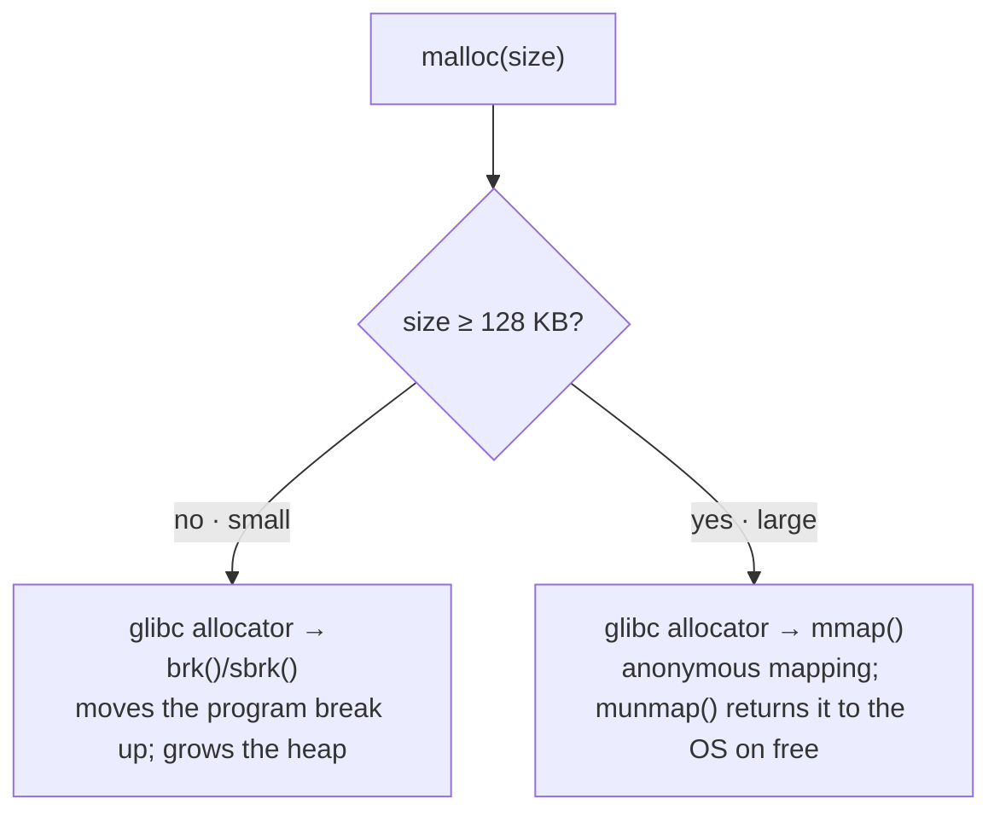

**Key points:**
- `brk()`/`sbrk()` extend the heap by moving the program break
- Small allocations reuse freed blocks from a free list (bins in glibc)
- Large allocations use `mmap()` → `munmap()` returns memory to OS immediately
- glibc uses **arenas** (per-thread memory pools) to reduce lock contention
- `free()` doesn't always return memory to the OS — it goes back to the allocator's free list

### Alternative Allocators

| Allocator | Key Feature | Used By |
|-----------|------------|---------|
| **glibc ptmalloc2** | Default on Linux, per-thread arenas | Most Linux programs |
| **jemalloc** | Low fragmentation, excellent multithreading | Facebook, Redis, Rust |
| **tcmalloc** | Thread-caching, low lock contention | Google, Go runtime |
| **mimalloc** | Microsoft, fast for small objects | Academic, benchmarks |

---

## 11. Memory Leak Detection

| Tool | Language | How It Works |
|------|----------|-------------|
| **Valgrind (Memcheck)** | C/C++ | Dynamic binary instrumentation; tracks every alloc/free |
| **AddressSanitizer (ASan)** | C/C++/Rust | Compile-time instrumentation; faster than Valgrind |
| **LeakSanitizer (LSan)** | C/C++ | Part of ASan; focused on leak detection |
| **Java VisualVM / JFR** | Java | Heap dumps, allocation tracking |
| **Go pprof** | Go | Heap profiling, allocation traces |

```bash
# Valgrind
valgrind --leak-check=full --show-leak-kinds=all ./my_program

# AddressSanitizer (compile with)
gcc -fsanitize=address -g my_program.c -o my_program
./my_program    # Reports leaks on exit
```

---

## 12. Stack vs Heap

| Aspect | Stack | Heap |
|--------|-------|------|
| **Allocation** | Automatic (function call) | Manual (`malloc`/`new`) or GC-managed |
| **Deallocation** | Automatic (function return) | Manual (`free`/`delete`) or GC |
| **Speed** | Very fast (just move stack pointer) | Slower (free list search, possible syscall) |
| **Size** | Limited (1–8 MB default) | Limited by virtual address space |
| **Fragmentation** | None | Yes (external fragmentation possible) |
| **Thread safety** | Each thread has its own stack | Shared — needs synchronization |
| **Growth** | Downward (high → low address) | Upward (low → high address) |
| **Overflow** | Stack overflow → segfault | OOM / allocation failure |
| **Data lifetime** | Current function scope only | Until explicitly freed |
| **Cache locality** | Excellent (contiguous LIFO) | Poor (scattered allocations) |

:::warning Stack Overflow
Default stack size is 8 MB on Linux (`ulimit -s`). Deep recursion or large local arrays can overflow it. Solutions: increase stack size, convert recursion to iteration, or allocate large buffers on the heap.
:::

---

## 🔥 Interview Questions

### Conceptual

1. **Explain virtual memory. Why does every process think it has the full address space?**
2. **What happens on a page fault?** Walk through the entire sequence.
3. **Why is TLB important? What happens on a TLB miss?**
4. **Compare LRU and Clock page replacement. Why don't we use exact LRU?**
5. **What is thrashing? How would you detect and resolve it?**
6. **Explain the difference between internal and external fragmentation.**

### Scenario-Based

7. **Your Java application's heap usage keeps growing but GC isn't reclaiming memory. How do you diagnose?** (Heap dump with jmap, analyze with Eclipse MAT, look for retained objects that shouldn't be alive.)
8. **A process has a 10 GB working set but the machine has 8 GB RAM. What happens?** (Continuous page faults, thrashing. Solutions: add RAM, optimize working set, use SSD for swap.)
9. **Why does `free` in Linux not immediately reduce RSS?** (glibc keeps freed memory in its arena for reuse. Only mmap'd regions are returned via munmap.)

### Quick Recall

| Question | Answer |
|----------|--------|
| Default page size on x86 | 4 KB |
| Huge page sizes on x86-64 | 2 MB, 1 GB |
| Levels in x86-64 page table | 4 (PML4, PDPT, PD, PT); 5 with LA57 |
| Default stack size (Linux) | 8 MB |
| DRAM latency | ~100 ns |
| SSD random read latency | ~16 μs |
| HDD seek latency | ~2-10 ms |
| malloc threshold for mmap | ~128 KB (glibc default) |
