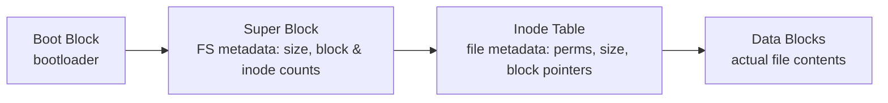
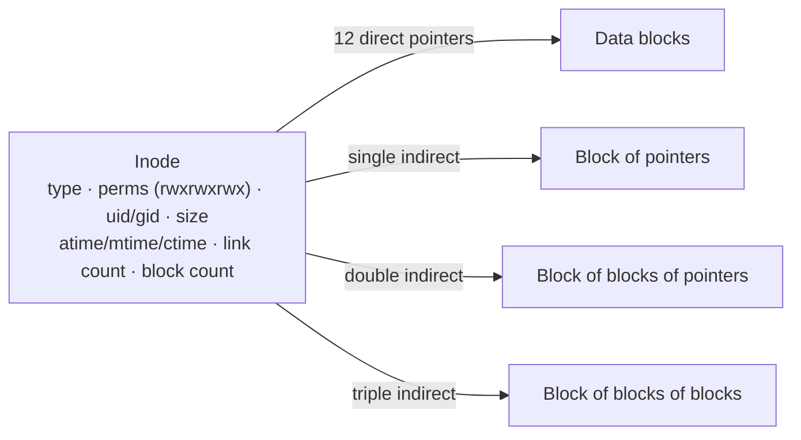
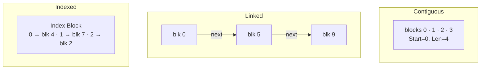
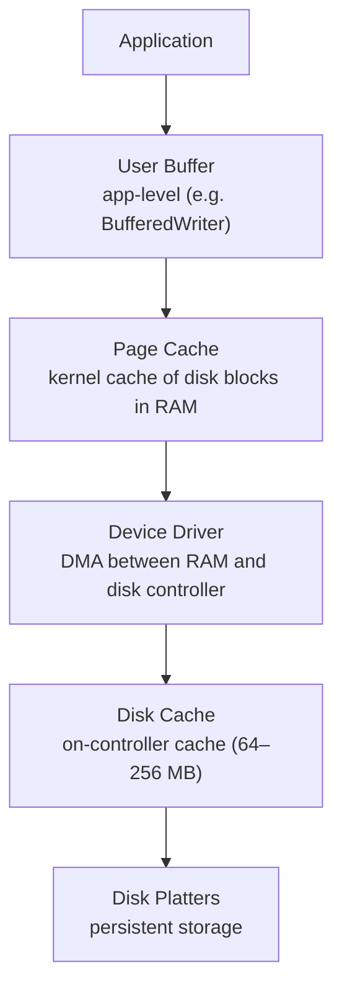

# 📁 File Systems & I/O

File systems and I/O are where the OS meets persistent storage. Understanding these concepts is critical for performance tuning, system design, and debugging storage-related issues.

---

## 1. File System Structure



| Component | Purpose |
|-----------|---------|
| **Boot Block** | Contains bootstrap code for OS startup |
| **Superblock** | File system metadata: total blocks, inode count, free blocks, block size, magic number |
| **Inode Table** | Array of inodes — one per file/directory |
| **Data Blocks** | Actual file content |
| **Block Group Descriptor** | (ext4) Groups inodes and data blocks together for locality |

---

## 2. Inode Structure

An **inode** (index node) stores all metadata about a file except its name.



### Block Pointer Calculation (4 KB blocks, 4-byte pointers)

| Level | Pointers | Blocks Addressable | Max File Data |
|-------|---------|-------------------|---------------|
| 12 direct | 12 | 12 | 48 KB |
| 1 single indirect | 1024 | 1024 | 4 MB |
| 1 double indirect | 1024² | 1,048,576 | 4 GB |
| 1 triple indirect | 1024³ | 1,073,741,824 | 4 TB |

:::info ext4 Extents
Modern ext4 replaced block pointers with **extents** — contiguous ranges of blocks stored as `(start_block, length)`. This dramatically reduces metadata for large files and improves sequential I/O.
:::

### Key Insight: Filenames Are NOT in the Inode

A **directory** is simply a special file that contains a mapping of `(name → inode number)` entries. This is why:
- Hard links work: multiple names point to the same inode
- Renaming a file is cheap: just update the directory entry
- `ls -i` shows inode numbers

```bash
$ ls -li
total 8
1234567 -rw-r--r-- 2 user group 100 Jan 1 10:00 file.txt
1234567 -rw-r--r-- 2 user group 100 Jan 1 10:00 hardlink.txt
# Same inode number (1234567), link count = 2
```

---

## 3. File Allocation Methods

| Method | Description | Pros | Cons |
|--------|-------------|------|------|
| **Contiguous** | File occupies consecutive blocks | Fast sequential access, simple | External fragmentation, file size must be known |
| **Linked** | Each block contains pointer to next | No external fragmentation | Slow random access (O(n)), pointer overhead |
| **FAT (File Allocation Table)** | Linked list stored in a separate table | Random access via table lookup | Table can be large, still sequential for large files |
| **Indexed (inode-based)** | Index block holds all block pointers | Fast random access | Index block overhead, multi-level for large files |



---

## 4. Common File Systems Comparison

| File System | Max File Size | Max Volume Size | Journaling | Key Features |
|-------------|-------------|----------------|-----------|-------------|
| **ext4** | 16 TB | 1 EB | Yes (metadata+data) | Linux default, extents, delayed allocation |
| **XFS** | 8 EB | 8 EB | Yes (metadata) | Excellent for large files, parallel I/O, used by RHEL |
| **Btrfs** | 16 EB | 16 EB | Copy-on-Write | Snapshots, checksums, compression, RAID built-in |
| **ZFS** | 16 EB | 256 ZB | Copy-on-Write | End-to-end checksums, dedup, compression, snapshots |
| **NTFS** | 16 EB | 256 TB | Yes | Windows default, ACLs, compression, encryption |
| **APFS** | 8 EB | 8 EB | Copy-on-Write | macOS/iOS, encryption, snapshots, space sharing |

:::tip ext4 vs XFS
**ext4** is a great general-purpose default. **XFS** excels at large sequential workloads (data warehouses, media streaming) and high-parallelism I/O. For databases, both work well, but XFS's delayed allocation and extent-based design often win for large tables.
:::

---

## 5. Journaling File Systems

A **journal** (write-ahead log) records changes before they're applied to the main file system. If the system crashes, the journal is replayed to restore consistency.

```
Write Operation with Journaling:

1. Write metadata changes to journal (transaction begin)
2. Write data blocks to journal (if full journaling)
3. Write transaction commit record
4. Apply changes to actual file system locations
5. Mark journal entry as complete

Crash Recovery:
- Committed transactions → replay (apply to FS)
- Uncommitted transactions → discard
```

| Journal Mode | What's Journaled | Performance | Safety |
|-------------|-----------------|-------------|--------|
| **journal** (full) | Metadata + data | Slowest | Safest |
| **ordered** (ext4 default) | Metadata only; data written before metadata commit | Medium | Good — prevents stale data exposure |
| **writeback** | Metadata only; data can be written in any order | Fastest | Risk of stale data after crash |

---

## 6. I/O Subsystem

### Buffering and Caching



| Concept | Description |
|---------|-------------|
| **Page Cache** | Kernel caches recently accessed file data in RAM. Reads hit cache; writes go to cache (write-back) and are flushed later |
| **Buffer Cache** | Historically separate from page cache; unified in modern Linux |
| **Write-back** | Data written to cache first, flushed to disk asynchronously (fast, risk of data loss on crash) |
| **Write-through** | Every write immediately goes to disk (slow, safe) |
| **Spooling** | Queuing output for slow devices (e.g., print spooler) |

---

## 7. Disk Scheduling Algorithms

For HDDs (with mechanical seek), the order of I/O requests significantly impacts performance. SSDs have ~uniform access time, making disk scheduling less critical.

**Example: Head starts at cylinder 53, request queue: 98, 183, 37, 122, 14, 124, 65, 67**

### FCFS

Process requests in arrival order.

```
Head movement: 53→98→183→37→122→14→124→65→67
               45  85  146  85  108 110  59  2  = 640 cylinders total
```

### SSTF (Shortest Seek Time First)

Go to the nearest request.

```
53→65→67→37→14→98→122→124→183
  12  2  30  23  84  24   2   59  = 236 cylinders
```

:::warning SSTF can starve requests far from the head position.
:::

### SCAN (Elevator)

Head moves in one direction, servicing requests, then reverses.

```
Direction: toward higher cylinders first
53→65→67→98→122→124→183→[end]→37→14
  12  2  31  24   2   59       146  23  = 299 cylinders
```

### C-SCAN (Circular SCAN)

Like SCAN, but when reaching the end, jumps back to the beginning without servicing.

```
53→65→67→98→122→124→183→[end→jump to 0]→14→37
  12  2  31  24   2   59         14  23  = 167 cylinders (+ jump)
```

### LOOK and C-LOOK

Like SCAN/C-SCAN but only go as far as the last request (don't go to disk end).

### Algorithm Comparison

| Algorithm | Total Seek | Starvation? | Notes |
|-----------|-----------|------------|-------|
| **FCFS** | 640 | No | Fair but inefficient |
| **SSTF** | 236 | Yes | Greedy, good throughput |
| **SCAN** | 299 | No | Uniform wait times |
| **C-SCAN** | 167* | No | Better uniformity than SCAN |
| **LOOK** | ~299 | No | Practical SCAN |
| **C-LOOK** | ~167* | No | Default in many disk schedulers |

---

## 8. RAID Levels

### RAID 0 — Striping (No Redundancy)

| Disk 0 | Disk 1 |
|--------|--------|
| A1 | A2 |
| A3 | A4 |
| A5 | A6 |

**Capacity:** N × disk_size · **Fault tolerance:** none (one disk fails → all data lost) · **Read/Write:** fastest.

### RAID 1 — Mirroring

| Disk 0 | Disk 1 (mirror) |
|--------|-----------------|
| A1 | A1 |
| A2 | A2 |
| A3 | A3 |

**Capacity:** disk_size (50% overhead) · **Fault tolerance:** 1 disk failure · **Read:** 2× (either copy) · **Write:** same (must write both).

### RAID 5 — Striping with Distributed Parity

| Disk 0 | Disk 1 | Disk 2 | Disk 3 | |
|--------|--------|--------|--------|---|
| A1 | A2 | A3 | **Ap** | parity for row A |
| B1 | B2 | **Bp** | B3 | parity rotates |
| C1 | **Cp** | C2 | C3 | |
| **Dp** | D1 | D2 | D3 | |

**Capacity:** (N−1) × disk_size · **Fault tolerance:** 1 disk failure · **Write penalty:** read old data + parity, compute new parity, write both.

### RAID 6 — Double Parity

```
Like RAID 5 but with TWO parity blocks per stripe.
Capacity: (N-2) × disk_size
Fault tolerance: 2 simultaneous disk failures
```

### RAID 10 — Mirrored Stripes

Stripe (RAID 0) **across** mirrored pairs (RAID 1):

| Mirror pair 1 (D0 / D1) | Mirror pair 2 (D2 / D3) |
|-------------------------|-------------------------|
| A1 / A1 | A2 / A2 |
| A3 / A3 | A4 / A4 |

**Capacity:** 50% (N/2 × disk_size) · **Fault tolerance:** 1 disk per mirror pair · **Best for:** databases (fast reads + writes + redundancy).

### RAID Comparison Table

| RAID | Min Disks | Capacity | Fault Tolerance | Read Speed | Write Speed | Use Case |
|------|----------|----------|----------------|-----------|------------|----------|
| **0** | 2 | N × size | None | Fastest | Fastest | Scratch data, caches |
| **1** | 2 | 1 × size | 1 disk | 2× | 1× | OS drives, small DBs |
| **5** | 3 | (N-1) × size | 1 disk | Fast | Slow (parity calc) | File servers, archives |
| **6** | 4 | (N-2) × size | 2 disks | Fast | Slower | Large arrays, archival |
| **10** | 4 | N/2 × size | 1 per pair | Fastest | Fast | Databases, high IOPS |

---

## 9. SSD vs HDD

| Aspect | HDD | SSD |
|--------|-----|-----|
| **Storage medium** | Magnetic platters + mechanical arm | NAND flash cells (no moving parts) |
| **Random read latency** | 2–10 ms (seek + rotational) | 25–100 μs |
| **Sequential read** | 100–200 MB/s | 500–7000 MB/s (NVMe) |
| **Write endurance** | Effectively unlimited | Limited write cycles (TBW) |
| **Power consumption** | 6–15W | 2–5W |
| **Noise** | Audible (spinning, seeking) | Silent |
| **Cost per GB** | ~$0.02/GB | ~$0.08/GB (NAND), ~$0.50/GB (enterprise NVMe) |
| **Shock resistance** | Low (mechanical damage risk) | High |

### SSD Internals

| Concept | Description |
|---------|-------------|
| **Wear Leveling** | Distributes writes evenly across cells to prevent premature failure of frequently-written blocks |
| **TRIM** | OS tells SSD which blocks are no longer in use, so the SSD can pre-erase them for faster future writes |
| **Write Amplification** | SSD must erase entire blocks (512 KB) before writing — writing 4 KB may trigger read-modify-write of 512 KB |
| **Garbage Collection** | SSD background process that consolidates valid pages and reclaims erased blocks |
| **Over-provisioning** | 7–28% of raw capacity reserved for GC, wear leveling, and bad block replacement |

---

## 10. I/O Models

| | Blocking | Non-blocking | Async I/O |
|---|---|---|---|
| **Call** | `read()` | `read()` → `EAGAIN` if not ready | `aio_read()` returns immediately |
| **While waiting** | thread blocks until data ready | poll / retry in a loop | kernel works in the background |
| **Completion** | returns when data ready | returns once a retry finds data | `callback()` (or signal) fires when ready |

| Model | Blocks Thread? | When Data Ready | Use Case |
|-------|---------------|----------------|----------|
| **Blocking** | Yes | Thread wakes up with data | Simple programs, thread-per-connection |
| **Non-blocking** | No (returns EAGAIN) | Application polls repeatedly | Rarely used alone |
| **I/O Multiplexing** | Blocks on selector, not on I/O | Selector returns ready FDs | Event-driven servers (nginx, Node.js) |
| **Async I/O** | No | Kernel signals completion | io_uring (Linux), IOCP (Windows) |

---

## 11. I/O Multiplexing

### select

```c
fd_set readfds;
FD_ZERO(&readfds);
FD_SET(sockfd, &readfds);

struct timeval tv = {5, 0};  // 5 second timeout
int ready = select(sockfd + 1, &readfds, NULL, NULL, &tv);

if (FD_ISSET(sockfd, &readfds)) {
    read(sockfd, buf, sizeof(buf));
}
```

### poll

```c
struct pollfd fds[2];
fds[0].fd = sockfd;
fds[0].events = POLLIN;

int ready = poll(fds, 2, 5000);  // 5 second timeout

if (fds[0].revents & POLLIN) {
    read(sockfd, buf, sizeof(buf));
}
```

### epoll (Linux)

```c
int epfd = epoll_create1(0);

struct epoll_event ev;
ev.events = EPOLLIN | EPOLLET;  // Edge-triggered
ev.data.fd = sockfd;
epoll_ctl(epfd, EPOLL_CTL_ADD, sockfd, &ev);

struct epoll_event events[MAX_EVENTS];
int nfds = epoll_wait(epfd, events, MAX_EVENTS, -1);

for (int i = 0; i < nfds; i++) {
    if (events[i].events & EPOLLIN) {
        read(events[i].data.fd, buf, sizeof(buf));
    }
}
```

### kqueue (macOS / BSD)

```c
int kq = kqueue();

struct kevent change;
EV_SET(&change, sockfd, EVFILT_READ, EV_ADD, 0, 0, NULL);
kevent(kq, &change, 1, NULL, 0, NULL);

struct kevent events[MAX_EVENTS];
int nev = kevent(kq, NULL, 0, events, MAX_EVENTS, NULL);

for (int i = 0; i < nev; i++) {
    if (events[i].filter == EVFILT_READ) {
        read(events[i].ident, buf, sizeof(buf));
    }
}
```

### Comparison

| Feature | select | poll | epoll | kqueue |
|---------|--------|------|-------|--------|
| **FD limit** | 1024 (FD_SETSIZE) | No limit | No limit | No limit |
| **Scalability** | O(n) scan every call | O(n) scan every call | O(1) per event (kernel maintains list) | O(1) per event |
| **Trigger mode** | Level-triggered | Level-triggered | Level or edge-triggered | Level or edge-triggered |
| **FD set copy** | Copies entire set to/from kernel | Copies entire set | No copy (kernel maintains) | No copy |
| **Portability** | POSIX (all Unix) | POSIX (all Unix) | Linux only | BSD / macOS |
| **Best for** | &lt;100 FDs, portable code | &lt;1000 FDs | 10K–1M connections (Linux) | 10K+ connections (macOS/BSD) |

:::tip Edge vs Level Triggered
- **Level-triggered** (default): epoll_wait returns as long as the FD is ready. Safe and simple.
- **Edge-triggered** (`EPOLLET`): epoll_wait returns only when state changes. You **must** read all available data or you'll miss events. Higher performance but harder to use correctly.

nginx uses edge-triggered epoll. Most applications should start with level-triggered.
:::

:::tip 🔌 Why It Matters in Your SE Role
`epoll`/`kqueue` is the engine under every "async, non-blocking, event-loop" framework you use — **Node.js, nginx, Redis, Netty, and the reactor in Spring WebFlux** all sit on top of it. This is the concrete answer to "how does Node handle thousands of connections on one thread?": one thread blocks in `epoll_wait`, the kernel hands back only the sockets that are *ready*, and the thread services them and loops. That's why an event-driven service can hold 100K idle connections cheaply while a thread-per-connection server would need 100K threads (~100 GB of stacks). It's also why **you must never make a blocking call inside an event loop** — one slow JDBC or filesystem call stalls *every* connection that thread is multiplexing. The OS theory (O(1) readiness notification vs O(n) `select` scan) is exactly why these frameworks exist.
:::

---

## 12. Zero-Copy I/O

Traditional file-to-socket transfer involves **4 copies** and **4 context switches**:

```
Traditional (read + write):
1. Disk → Kernel buffer    (DMA copy)
2. Kernel buffer → User buffer  (CPU copy + context switch)
3. User buffer → Socket buffer  (CPU copy + context switch)
4. Socket buffer → NIC     (DMA copy)

Total: 4 copies, 4 context switches
```

**sendfile()** eliminates user-space copies:

```
sendfile() Zero-Copy:
1. Disk → Kernel buffer    (DMA copy)
2. Kernel buffer → NIC     (DMA copy, with SG-DMA)

Total: 2 copies (DMA only), 2 context switches
```

```c
#include <sys/sendfile.h>

int in_fd = open("large_file.bin", O_RDONLY);
// sockfd is an open socket
off_t offset = 0;
sendfile(sockfd, in_fd, &offset, file_size);
```

:::tip Where Zero-Copy Matters
- **Web servers** serving static files (nginx uses sendfile)
- **Kafka** uses sendfile to transfer log segments to consumers
- **CDNs** and **file transfer services**
- Any scenario transferring large amounts of data from disk to network
:::

---

## 🛠️ Applying This in Your SE Role

File systems and I/O look far from application code — until you're explaining why data vanished after a crash, why a service melts under connection load, or why your storage bill is dominated by IOPS. The two ideas that pay off most here are **durability** (page cache vs `fsync`) and **the I/O model** (blocking vs event-driven).

### Where this shows up in everyday work

| You're doing this… | …and the file-system / I/O concept behind it is |
|--------------------|--------------------------------------------------|
| Choosing a reactive/async framework (Node, Netty, WebFlux) | `epoll`/`kqueue` I/O multiplexing — many connections, few threads |
| Tuning Postgres `fsync`, `synchronous_commit`, or a WAL | Journaling / write-ahead logging and write-back vs write-through |
| Picking an AWS EBS volume type / provisioned IOPS | HDD vs SSD random-IOPS reality, RAID-like striping |
| Kafka throughput tuning | **Zero-copy** `sendfile` + sequential writes hitting the page cache |
| "We acknowledged the write but lost it after a power cut" | Write-back **page cache** — data wasn't `fsync`'d to disk |
| A thread-per-connection server falling over at ~10K clients | The C10K problem — wrong I/O model for the scale |

### What to actually do

- **Know where "written" really means "durable."** A successful `write()` only lands in the page cache. Until `fsync()`/`fdatasync()` returns, a power loss can lose it. This is *why* databases have a WAL and `fsync` on commit — and why disabling `fsync` "for speed" is a data-loss bug waiting for the next crash.
- **Match the I/O model to the workload.** Thread-per-connection is fine for a few hundred connections and simple code; for tens of thousands of mostly-idle connections (chat, streaming, long-poll), use an event loop. Don't bring blocking calls into that event loop.
- **Lean on the page cache instead of fighting it.** Sequential access and letting hot data stay cached often beats clever application-level caching. It's why append-only logs (Kafka, LSM-tree DBs) are so fast.
- **Provision storage by IOPS, not just GB.** A random-read-heavy database on an HDD-backed or low-IOPS volume will be seek-bound (~10 ms each). Reach for SSD/NVMe or provisioned IOPS, and use RAID 10 (not RAID 5) for write-heavy databases.

:::warning 🔥 War Story — The Writes That Were "Saved" but Gone After a Power Cut
An IoT ingestion service wrote each event to a local file and returned `200 OK` to the device the instant `write()` succeeded. In load tests and normal operation it was flawless and fast. Then a rack lost power, and after reboot the team found **the last ~30 seconds of "successfully saved" events were simply missing** — even though every device had received a success response.

The cause was the **write-back page cache**. `write()` had only copied the bytes into kernel page cache; Linux flushes dirty pages lazily (typically every few seconds). Those pages had never been `fsync`'d to the SSD when the power dropped, so they evaporated — exactly the "writeback mode: risk of stale data after crash" row in the journaling table. The service had been *acknowledging durability it never had*. **Fix:** call `fdatasync()` before returning success for events that truly must survive a crash (and batch the syncs to amortize cost), or hand durability to a real datastore with a configured WAL. The lesson — *the OS makes writes look instant and permanent by caching them in RAM; "the write succeeded" and "the data is on disk" are two different events, and only `fsync` bridges them.*
:::

---

## 🔥 Interview Questions

### Conceptual

1. **What is an inode? What information does it NOT contain?** (Doesn't contain the filename — that's in the directory entry.)
2. **Explain journaling. Why is ext4's "ordered" mode a good default?** (Data written before metadata commit prevents stale data exposure.)
3. **What are the trade-offs between RAID 5 and RAID 10?** (RAID 5: more capacity, slower writes. RAID 10: faster but 50% overhead.)
4. **Explain the difference between level-triggered and edge-triggered epoll.**
5. **What is zero-copy I/O? Where is it used?**

### Scenario-Based

6. **Your web server is serving large static files slowly. How would you optimize?** (sendfile, mmap, increase page cache, use CDN, enable aio.)
7. **A database server on RAID 5 has slow write performance. What do you recommend?** (Switch to RAID 10 for write-heavy workloads, or add battery-backed write cache.)
8. **Your application needs to handle 100K concurrent connections on Linux. What I/O model do you use?** (epoll with edge-triggered mode, non-blocking sockets. Consider io_uring for newer kernels.)

### Quick Recall

| Question | Answer |
|----------|--------|
| Linux default filesystem | ext4 |
| ext4 max file size | 16 TB |
| epoll system call (Linux) | `epoll_create1`, `epoll_ctl`, `epoll_wait` |
| macOS equivalent of epoll | kqueue |
| Windows equivalent of epoll | IOCP (I/O Completion Ports) |
| select FD limit | 1024 (FD_SETSIZE) |
| RAID level for databases | RAID 10 |
| Zero-copy syscall (Linux) | `sendfile()` |
| Kafka uses which I/O optimization | sendfile (zero-copy) |
